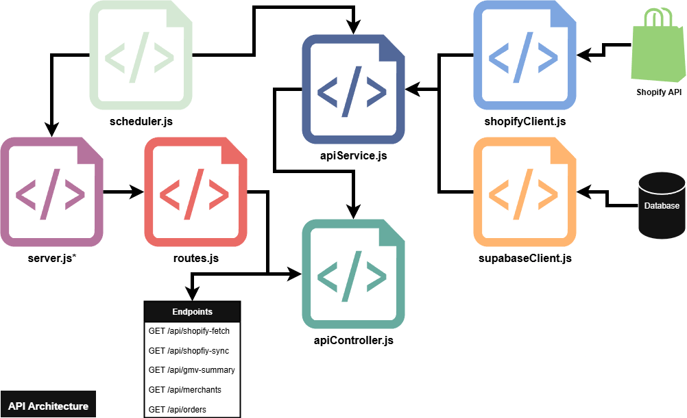
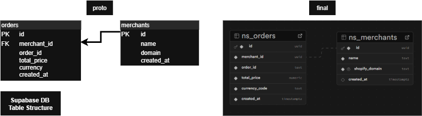

# Notes

This document outlines the internal structure, database schema, and future improvement areas.

---

## Observations & Limitations

The microservice was designed to be built with extendability. Instead of jamming everything into one file, I split it into layers: routes, controller logic, service logic, and external clients. That way, if anything changes, like if it needs to fetch more data from Shopify, tweak sync logic, or add new endpoints theres no need to tear apart the whole thing.
The `server.js` starts the Express app, wires up the routes, and loads in the scheduler.
All HTTP endpoints are declared in `routes.js`, which calls the controller methods in `apiController.js`.

From there, the controller functions call `apiService.js`, which acts as the go-between for Shopify and Supabase. The `shopifyClient.js` handles all GraphQL requests to the Shopify API. The `supabaseClient.js` deals with reads and writes to the Supabase DB.
The `scheduler.js` runs a node-cron task every hour to fetch new orders, so the system stays in sync without manual work.

The Supabase schema mirrors Shopify’s order structure in a straightforward way, making it easy to query for GMV summaries or inspect order data quickly.

---

## Future Improvements

- Performance: Add cursor-based pagination to the Shopify query to support large datasets.
- Error Handling: Add better error logging, including error propagation and visibility for debugging or monitoring.
- Deduplication: Double-check for existing orders before inserting them into Supabase (currently handled with a basic ID check).
- Auth: Lock down `/api/` routes with API keys or JWTs for production use.
- Testing: Add unit tests for each service layer (shopifyClient, apiService, etc.).
- Scaling: Containerise the service with Docker and deploy on a serverless platform (e.g. Fly.io, Railway) for production.
- CI/CD: Set up GitHub Actions to automatically lint, test, and deploy when changes hit main.

---